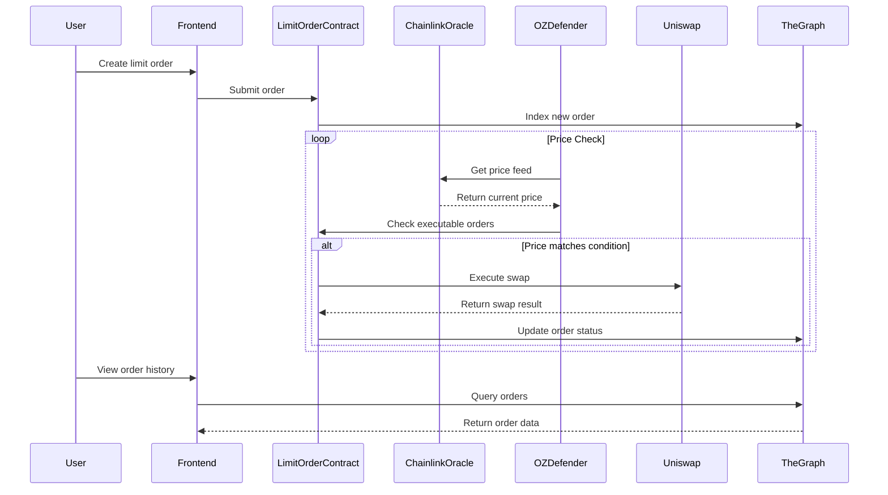

# Decentralized Limit Order System

This repository contains a decentralized limit order system built during the Metana Bootcamp. The project leverages smart contracts, automated monitoring, and multiple blockchain integrations to provide a seamless, trustless trading experience.

## Overview

The system allows users to create limit orders through a user-friendly SvelteKit 5 front-end. Once submitted, orders are stored in a smart contract and indexed via a local subgraph using The Graph. Automated checks using OpenZeppelin Defender continuously monitor the market using real-time price feeds from Chainlink’s Feed Registry. When the conditions for execution are met, the smart contract triggers a token swap on Uniswap, and the order status is updated accordingly.

The following sequence diagram outlines the core workflow:



## Key Features

- **User-Friendly Interface:** Built with SvelteKit 5 for a responsive and intuitive user experience.
- **Automated Order Execution:** Uses OpenZeppelin Defender Automation to continuously monitor market prices and execute orders when conditions are met.
- **Reliable Price Feeds:** Integrates Chainlink’s Feed Registry to obtain accurate and real-time price data.
- **Uniswap Integration:** Executes token swaps on Uniswap when the specified limit order conditions are satisfied.
- **Efficient Data Indexing:** Leverages The Graph for quick and reliable order indexing and querying.
- **Robust Testing:** Deployed on Tenderly testnet with comprehensive tests using Smock to ensure security and stability.

## Technologies Used

- **Frontend:** [SvelteKit 5](https://kit.svelte.dev/)
- **Smart Contracts:** Solidity
- **Testnet Environment:** Tenderly
- **Automation:** OpenZeppelin Defender Automation
- **Price Feeds:** Chainlink Feed Registry
- **DEX Integration:** Uniswap
- **Data Indexing:** The Graph
- **Testing Framework:** Smock

## Getting Started

### Prerequisites

- Node.js (v14 or higher)
- npm or yarn
- A compatible Ethereum development environment (e.g., Hardhat)

### Installation

1. **Clone the repository:**

   ```bash
   git clone https://github.com/yourusername/limit-order-system.git
   cd limit-order-system
   ```

2. **Install dependencies:**

   ```bash
   npm install
   # or
   yarn install
   ```

3. **Compile Smart Contracts:**

   If using Hardhat:
   ```bash
   npx hardhat compile
   ```

### Running the Frontend

Start the SvelteKit development server:

```bash
npm run dev
# or
yarn dev
```

Visit [http://localhost:3000](http://localhost:3000) to interact with the application.

### Testing

Run the tests to ensure everything works as expected:

```bash
npm run test
# or
yarn test
```

### Deployment

Deployment is automated using OpenZeppelin Defender. Make sure you have set the required environment variables:

- `DEFENDER_API_KEY`
- `DEFENDER_API_SECRET`
- Additional configuration for Chainlink, Uniswap, etc.

Refer to the deployment scripts in the `scripts/` folder for more details on deploying the smart contracts and front-end.

## Contributing

Contributions are welcome! Please fork the repository and open a pull request with any improvements or bug fixes.

## License

This project is licensed under the MIT License.

## Acknowledgements

- [Metana Bootcamp](#)
- [SvelteKit](https://kit.svelte.dev/)
- [Chainlink](https://chain.link/)
- [OpenZeppelin Defender](https://defender.openzeppelin.com/)
- [Uniswap](https://uniswap.org/)
- [The Graph](https://thegraph.com/)
- [Tenderly](https://tenderly.co/)
- [Smock](#)

